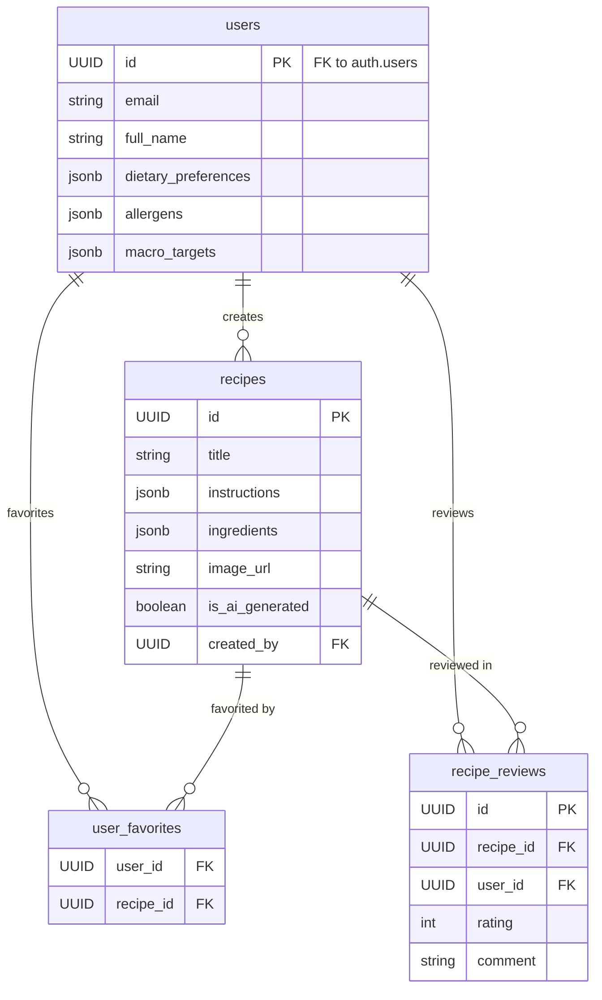

# 🗃️ Database Schema

This document provides a high-level overview of the ChompChew database schema, which is managed using Supabase (PostgreSQL). For the complete source of truth, please refer to `supabase/schema.sql`.

## Data Model Diagram

This diagram illustrates the relationships between the core tables in the database.

## Core Tables

### `users`
-   **Purpose**: Stores all public user profile information. This table extends the private `auth.users` table provided by Supabase.
-   **Key Columns**:
    -   `id`: Primary Key, and a Foreign Key linking directly to `auth.users.id`.
    -   `dietary_preferences`, `allergens`, `macro_targets`: JSONB fields that store the core of the user's personalization profile.
-   **Automation**: A new user profile is automatically created in this table whenever a new user signs up via Supabase Auth, thanks to a trigger (`on_auth_user_created`).

### `recipes`
-   **Purpose**: Stores all recipe data, whether it's created by a user or generated by the AI.
-   **Key Columns**:
    -   `instructions`, `ingredients`, `nutrition_info`: Rich data stored in JSONB format.
    -   `is_ai_generated`: A boolean flag to distinguish between user-submitted and AI-generated content.
    -   `created_by`: Foreign Key linking to the `users` table to establish ownership.
    -   `rating_average`, `rating_count`: Denormalized fields that are automatically updated by triggers whenever a review is added, updated, or deleted. This improves query performance.

### `user_favorites`
-   **Purpose**: A join table that creates a many-to-many relationship between `users` and `recipes`. This is how users "save" or "favorite" recipes.
-   **Key Columns**:
    -   `user_id` and `recipe_id`: A composite key that is unique, preventing a user from favoriting the same recipe twice.

### `recipe_reviews`
-   **Purpose**: Stores user-submitted reviews and ratings for recipes.
-   **Key Columns**:
    -   `rating`: An integer from 1 to 5, enforced by a `CHECK` constraint.
    -   `user_id` and `recipe_id`: A composite unique key to ensure a user can only review a specific recipe once.

## Security: Row Level Security (RLS)

A critical aspect of the database architecture is the extensive use of Row Level Security (RLS).

-   **RLS is ENABLED on all tables containing user data.**
-   **Default Deny**: Supabase's approach is "default deny". No data can be accessed unless a specific `POLICY` grants permission.
-   **Policies**:
    -   Users can only ever view and modify their own profiles, favorites, shopping lists, etc.
    -   Users can view public recipes but can only modify or delete recipes they created.
    -   This ensures a strong security posture and multi-tenancy, where users' data is strictly isolated from other users at the database level.

This setup ensures that the data is not only well-structured but also secure by default. 